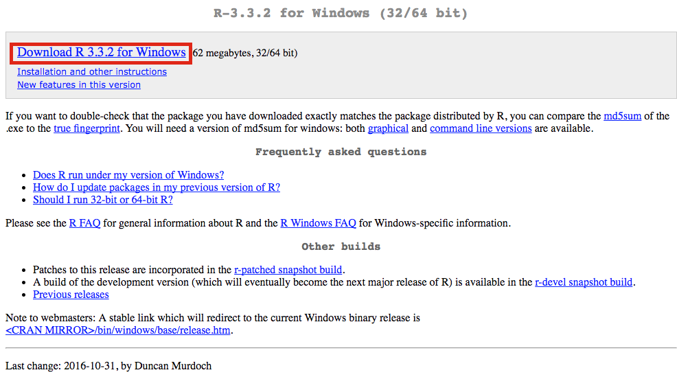
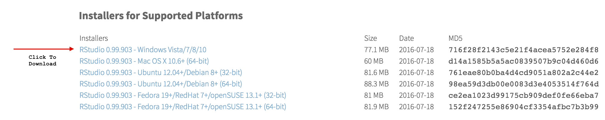

# Software Installation

In this course, we'll be using a variety of different software programs to write, manage, and execute the code that we write. Unfortunately, one of the most frustrating and confusing barriers to start working with code is simply getting your machine properly set-up, so set aside some time and dig in.

Note, classroom machines for this course should have all appropriate software already installed and ready to use.

## Summary
In short, you'll need to install the following programs: see below for more information / options. While the rest of this book is about Python, we'll also be using R and RStudo in this course:

- **Anaconda (Python)**: A _python distribution_ that also includes _notebook capabilities_ through Jupyter notebooks ([link](https://www.continuum.io/downloads))
- **R**: A statistical programming language used to wrangle, analyze, and visualize data ([mac](https://cran.r-project.org/bin/macosx/), [windows](https://cran.r-project.org/bin/windows/base/))
- **RStudio**: An interface for writing and running R code, which is a primary language for the quarter ([link](https://www.rstudio.com/products/rstudio/download3/))
- **Git**: A set of command-line tools for tracking changes to a project. This is likely already installed on Macs. The Windows download will come with Git Bash, a simple interface for executing Git commands ([link](https://git-scm.com/downloads)).
- **Visual Studio Code**: A text-editor in which to write longer programming scripts ([link](https://code.visualstudio.com/download)).

The following sections have additional information about the purpose of each component, how to install it, and alternative configurations.

## R
R is a popular data science language used to download, analyze, and visualize data. You can download it at the appropriate link for your operating system ([mac](https://cran.r-project.org/bin/macosx/), [windows](https://cran.r-project.org/bin/windows/base/)). At the link, click the appropriate download link and follow instructions:

## RStudio
The primary programming language we will use throughout the course is R. It's a very powerful statistical programming language that is built to work well with large and diverse datasets. While you are able to execute R scripts without an interface, the RStudio interface provides a wonderful way to engage with the R language. Importantly, you **cannot use the RStudio interface until you have installed R.**

To download the RStudio program, select the installer for your operating system at this [link](https://www.rstudio.com/products/rstudio/download3/). Make sure to scroll down to download a **free** version of RStudio:

Once the download completes, double-click on the `.exe` file to run the installer. Simply follow the steps of the installer, and you should be prepared to use RStudio. By downloading RStudio, you will also install the R programming language, if it is not already present in your operating system.

## Anaconda (Python)
Python is a very popular all-purpose programming language that is making a major impact in the data-science arena. While Python may already be installed on your machine, it is common to download a _Python Distribution_, which also downloads a variety of commonly used packages.

The **Anaconda** distribution is popular because it also provides support for Jupyter notebooks (workbooks for documenting and sharing data science work). The internet is flooded with debates about _Python 2 v.s. Python 3_, but you should download **Python 3**. Python 3 is "the future", but many libraries only provide Python 2 support. Download [here](https://www.anaconda.com/download).

## Git
Git is a version control system that provides a set of commands that allow you to manage changes to a project (much more on this in [module-3](https://github.com/info-201/m3-version-control)). For now, you'll need to [download](https://git-scm.com/downloads) and install the software. Note, if you are using a Windows machine, this will install a program called Git Bash, which provides a text-based interface for executing commands on your computer. For alternative/additional Windows command-line tools, see below.

## Command-line Tools (Windows)
The command-line provides you a text-based interface for providing instructions to your computer. In this course, we'll largely use the command-line for navigating our computer's file structure, and executing commands that allow us to keep track of changes to the code we write (i.e., version control). If you're using a Mac, you are able to access your command-line by default, and don't need to install any additional software. If you're using a Windows machine, you'll need to install one of the following programs in order to interact directly with the command-line.

### Git Bash
Because we'll primarily use the command line for implementing version control (i.e., keeping track of changes to our code), we can use a command-line tool that ships with the version control software, Git. When you download the [Git](https://git-scm.com/downloads) software on Windows, the Git Bash user-interface will be installed. You can then navigate to Git Bash from your Desktop / Start Menu, and you will be able to use the appropriate syntax to keep track of code changes.

### Windows Bash
With the release of Windows 10, Windows began providing command line (bash) support. If you already have Windows 10, here are a few [instructions](http://www.howtogeek.com/249966/how-to-install-and-use-the-linux-bash-shell-on-windows-10/) for installing bash capabilities. This requires that you [switch to 64 bit windows](http://www.howtogeek.com/228042/how-to-switch-from-32-bit-windows-10-to-64-bit-windows-10/), and follow the instructions above. While this will provide you with direct bash capabilities, you may run into challenges along the way (I have not tested these instructions). Note, you will still **need to install Git** in addition to Windows Bash.

### Powershell (Windows Management Framework)
If you want to explore more robust command-line alternatives for Windows, the Windows Management Framework (including a program called Powershell) seems to be a preferred standard. Powershell will provide a simple text-based interface for inputing commands. Note, you will still **need to install Git** in addition to Powershell.

## Text Editors
In order to write code, you need somewhere to write it (obviously). There are a variety of available programs that provide an interface for editing code. A major advantage of these programs is that they provide automatic formatting for easier interpretation of the code, along with cool features like auto-completion and integration with version control.

RStudio has a great built in text editor, but you'll (at times) want to use another text editor which is more robust, or designed for a different programming language. You really only need to download one of the following programs, but feel free to download multiple text-editors to compare and contrast how you like them.

### Visual Studio Code 
[Visual Studio Code](https://code.visualstudio.com/) (or VS Code; not to be confused with Visual Studio) is a free, open-source editor developed by Microsoft&mdash;yes, really. It focuses on web programming and JavaScript, though also supports many other languages and provides a number of [community-built extensions](https://code.visualstudio.com/docs/editor/extension-gallery) for adding even more features. Although fairly new, it is updated regularly and has has become one of our main editors for programming. VS Code is actually a stand-alone web application, so it's written in the same HTML, CSS, and JavaScript you'll learn in this course!

To install VS Code, follow the above link and Click the "Download" button to download the installer (e.g, `.exe`) file, then double-click on that to install the application.

Once you've installed VS Code, the trick to using it effectively is to get comfortable with the [Command Palette](https://code.visualstudio.com/docs/getstarted/userinterface#_command-palette). If you hit `Cmd+Shift+P`, VS Code will open a small window where you can search for whatever you want the editor to do. For example, if you type in `markdown` you can get list of commands related to Markdown files (including the ability to open up a preview). The `Format Code` option is particularly useful.

For more information about using VS Code, see [the documentation](https://code.visualstudio.com/docs), which includes [videos](https://code.visualstudio.com/docs/getstarted/introvideos) if you find them useful.

### SublimeText
SublimeText is a very popular text editor with excellent defaults and a variety of available extensions. One drawback is that, to use it without paying, you are using an unlimited free trial. Every ~10 times you save a file, it will ask you if you want to purchase the full version, which is a bit distracting. [SublimeText2](http://www.sublimetext.com/2) is the current stable version of the software, though feel free to install [SublimeText3](http://www.sublimetext.com/3) if you don't mind using software that's in beta.

### Atom
Atom is a text editor built by the folks at GitHub, and has been gaining in popularity. As an open source project, people are continually building (and making available) interesting/useful extensions. It's built-in spell-check is a great feature, especially for documents that require lots of written text. See more and download [here](https://atom.io/).

If you run into any installation/configuration challenges, please let others know on the slack channel so that others can anticipate the same issues.

## Resources
- [RStudio](https://www.rstudio.com/products/rstudio/download3/)
- R [mac](https://cran.r-project.org/bin/macosx/), [windows](https://cran.r-project.org/bin/windows/base/)
- [Anaconda (Python)](https://www.continuum.io/downloads)
- [SublimeText2](http://www.sublimetext.com/2)
- [Atom](https://atom.io/)
- [Installing Bash on Windows](http://www.howtogeek.com/249966/how-to-install-and-use-the-linux-bash-shell-on-windows-10/)
- [Jupyter Notebooks](http://jupyter.org/)
